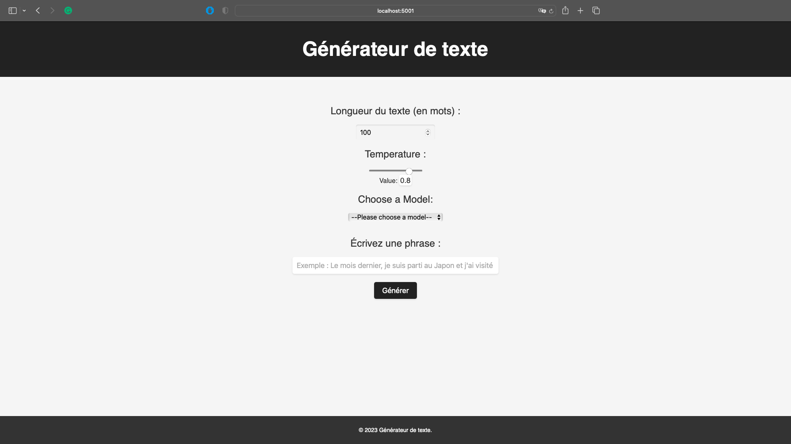
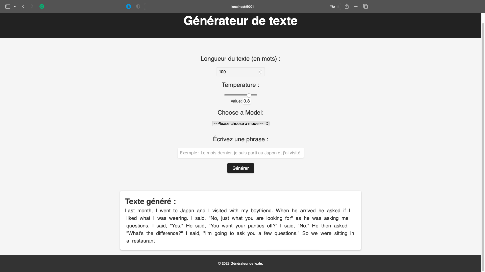

# Text Generation - Transformers

Demonstration of text generation.





3 models are available:
* GPT-2 (100M parameters) - HuggingFace
* GPT-3 - via OpenAI API (ada)
* Our own model - (10M parameters) trained on a dataset of X sentences for 6000 epochs - _not available yet_

## Run the app 
```bash 
docker build -t thekenken/text-generation-demo:latest . && docker push thekenken/text-generation-demo:latest && docker run -p 5001:5000 thekenken/text-generation-demo:latest
```

## Info about the project

* `app.py` - the main file of the app
* `requirements.txt` - the list of requirements
* `text_generation.py` - the file that generate the text
* `manifests/` - the folder that contains the manifest files (k8s specifications) 
* `templates/` - the folder that contains the html files
* `Dockerfile` - to launch the app on localhost:5000

## Result


# Contact
[moi](https://www.linkedin.com/in/kenan-gonnot/)
